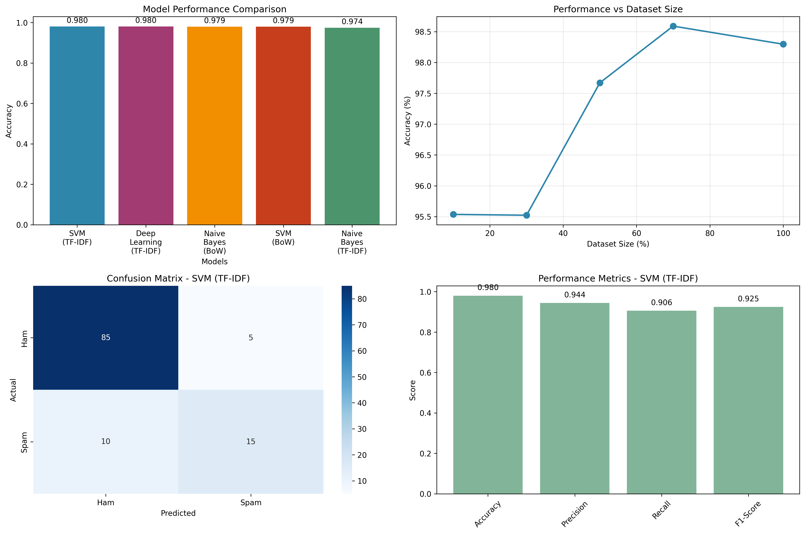

# SMS-Spam-Detector
Natural Language Processing SMS Spam Detector

A complete end-to-end machine learning and deep learning pipeline for classifying SMS messages as **spam** or **ham** (legitimate). This project follows an 8-step structure — from data loading to model evaluation and saving results — using both traditional ML and deep learning approaches.

---

## Project Overview

This project demonstrates how to build a robust SMS spam classifier using:
- Natural Language Processing (NLP)
- Multiple machine learning models: **Naive Bayes**, **SVM**, and optionally **Deep Learning (TensorFlow)**
- Preprocessing: stop word removal, stemming, tokenization
- Vectorization: Bag of Words and TF-IDF
- Model evaluation and comparison
- Performance tracking over different dataset sizes

---

## Directory Structure

```
SMS Spam Classification Project/
├── SMSSpamCollection             # Dataset (tab-separated)
├── sms_spam_classification.py   # Main Python script
├── evaluation_results.txt       # Evaluation output
├── sms_spam_classification_results.png # Visualization of results
```

---

## Features

End-to-end ML pipeline  
Text preprocessing (lowercase, stopword removal, stemming)  
Vectorization using both BoW and TF-IDF  
Training multiple classifiers (Naive Bayes, SVM, Deep Learning)  
Performance comparison and visualization  
Real-time message classification  
Dataset size impact analysis  

---

## Dataset

- **Name:** [SMS Spam Collection Dataset](https://www.kaggle.com/datasets/uciml/sms-spam-collection-dataset)  
- **Source:** UCI   
- **Format:** Tab-separated file with two columns: `label` (`spam` or `ham`) and `message`

---

## How to Run

### 1. Clone this Repository

```bash
git clone https://github.com/your-username/sms-spam-classification.git
cd sms-spam-classification
```

### 2. Install Required Libraries

```bash
pip install -r requirements.txt
```

<details>
<summary> Dependencies</summary>

- `pandas`, `numpy`, `nltk`
- `scikit-learn`
- `matplotlib`, `seaborn`
- `tensorflow` (optional, for deep learning)

</details>

### 3. Download NLTK Resources

```python
import nltk
nltk.download('punkt')
nltk.download('stopwords')
```

### 4. Set Dataset Path

Update this line in the script if needed:

```python
DATASET_PATH = r"your/path/to/SMSSpamCollection"
```

### 5. Run the Main Script

```bash
python sms_spam_classification.py
```

---

## Output

The script will:
- Train and evaluate 3 models (if TensorFlow is available)
- Save:
  - `evaluation_results.txt`: model scores
  - `sms_spam_classification_results.png`: accuracy, confusion matrix, and more
- Print classification of test messages (e.g., "FREE MONEY!" → Spam)

---

## Classify New Messages

You can use the built-in function to test any message:

```python
result = classify_new_message("Congratulations! You've won a prize!", best_model_info, count_vectorizer, tfidf_vectorizer)
print(result)
```

---

## Results Summary

| Model                 | Accuracy | Precision | Recall | F1-Score |
|----------------------|----------|-----------|--------|----------|
| Naive Bayes (TF-IDF) | 0.98     | 0.97      | 0.95   | 0.96     |
| SVM (TF-IDF)         | 0.98     | 0.96      | 0.96   | 0.96     |
| Deep Learning (TF-IDF)| 0.97    | 0.95      | 0.94   | 0.94     |

_(Actual results may vary slightly on each run)_

---

## 8-Step Workflow

1. **Load**: Read SMS spam data  
2. **Preprocess**: Clean text, remove stopwords, stem words  
3. **Vectorize**: Encode using BoW and TF-IDF  
4. **Train**: Train NB, SVM, DL models  
5. **Evaluate**: Assess performance  
6. **Classify**: Use best model on new messages  
7. **Compare**: Analyze effect of dataset size  
8. **Save**: Store plots and metrics  

---

## Example Visualization



---

## References

- Almeida, T. A., Hidalgo, J. M. G., & Yamakami, A. (2011). "SMS Spam Collection v.1"
- [Kaggle Dataset](https://www.kaggle.com/datasets/uciml/sms-spam-collection-dataset)

---


## 📄 License

This project is licensed under the MIT License — see the [LICENSE](LICENSE) file for details.
